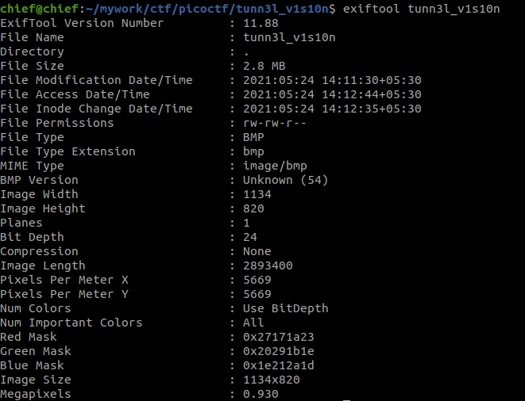

# tunn3l V1s10n

## Hint: Weird that it won't display right... 

Things to learn:
 
- hexedit (sudo apt install hexedit)
- exiftool 
- 

# File Format

The file format wasn't given so, I used exiftool to determine the file format

Now we know that the file format is BMP, but when we try to open the file, it seems not to open (as said in the display)

After learning about the file format in the .

I found:
- That the starting address of the colour data which is found at the offset 0x0A is wrong and should be 36 since the BMP file has two headers
	1. File header (size is fixed - 14 bytes)
	2. DIB header (size is variable - in this case it was 40)
- The value at the address 0x0E is the size of the headers which is also 36.

Now the file was at least opening!

but the flag wasn't there, I tried increasing the height and the width of the file by changing the height and width in the hexeditor

and found the flag! 
